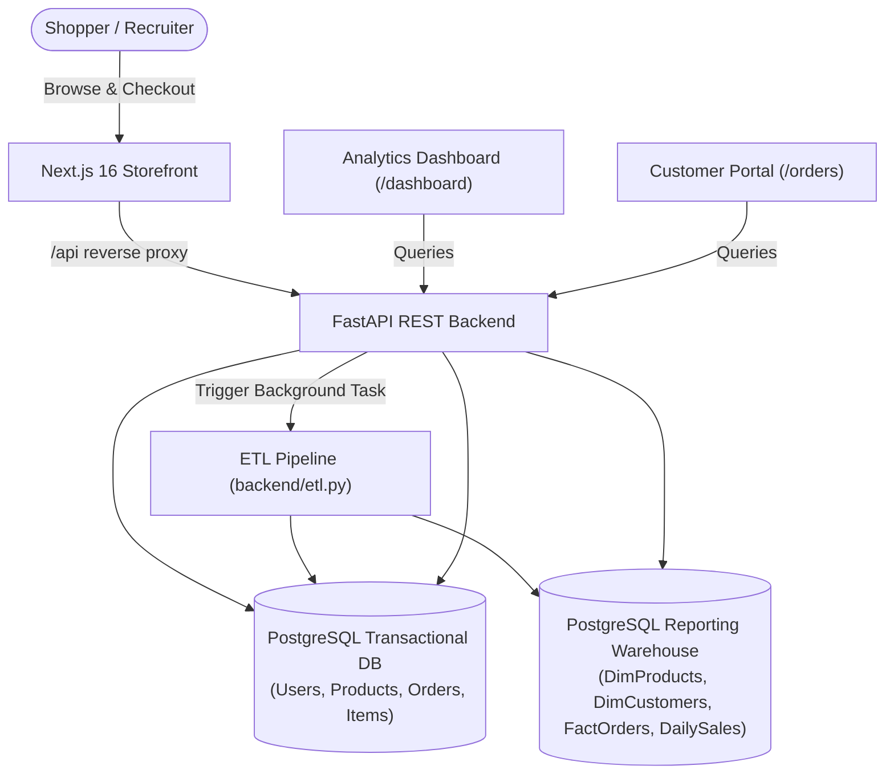

# Archive Thrift — Full-Stack E-Commerce & Analytics Platform

[](https://nextjs.org/)
[](https://fastapi.tiangolo.com/)
[](https://www.postgresql.org/)
[](https://www.typescriptlang.org/)
[](https://tailwindcss.com/)
[](https://www.docker.com/)

Archive Thrift is a production-grade full-stack thrift-store e-commerce system featuring a luxury storefront, FastAPI backend, dual PostgreSQL databases (OLTP transactional DB + separate OLAP analytical warehouse), automated ETL pipeline, and live executive dashboard.

---

## 🚀 Live Demo & Portfolio Access

| Resource | Link / Details |
|---|---|
| **Demo Login** | **Email:** `demo@example.com` &bull; **Password:** `DemoPass123` |
| **Quick Demo Access** | Use the **"1-Click Demo Login"** button on the `/login` page for instant access without signing up. |
| **Deployment Guide** | [docs/PORTFOLIO_DEPLOYMENT_GUIDE.md](docs/PORTFOLIO_DEPLOYMENT_GUIDE.md) *(Permanent 100% Free Zero-Expiration Setup on Vercel + Render + Neon)* |

---

## 🛠️ Tech Stack & Architecture

| Layer | Technology | Purpose |
|---|---|---|
| **Frontend** | Next.js 16 App Router, React 19, TypeScript, Tailwind CSS 4, Lucide Icons | Responsive luxury storefront, client cart, customer portal |
| **Backend** | FastAPI, SQLAlchemy, Uvicorn/Gunicorn, Pydantic | High-performance RESTful API with background tasks |
| **Transactional DB (OLTP)** | PostgreSQL (or SQLite fallback) | ACID transactional store for users, catalog, stock, and orders |
| **Reporting DB (OLAP)** | PostgreSQL (or SQLite fallback) | Dimension & fact tables optimized for aggregations |
| **Data Pipeline (ETL)** | Python script (`backend/etl.py`) | Automated on order creation via FastAPI BackgroundTasks or Linux cron |
| **Deployment Options** | Vercel (Frontend) + Render/Koyeb (Backend) + Neon (DB) OR Docker Compose | Zero downtime, permanent free hosting for portfolio showcases |



---

## ✨ Key Features

1. **Curated Storefront & Catalog:**
   - Filter by categories (*Clothing, Bags, Accessories*), search by keywords, and sort by *Price (Low/High), Newest, or Featured*.
   - Product details with high-resolution image galleries, condition ratings, era tags, and real-time stock availability.
2. **Flash-Sale Concurrency & Reservation:**
   - In-memory/Redis TTL locks preventing double-spending and overselling during simultaneous checkouts.
3. **Cart & Protected Checkout:**
   - Quantity-aware slide-out drawer and dedicated checkout page.
   - Courier selection (J&T Express, Flash Express) and payment methods (GCash, COD, Online Payment).
4. **Customer Order Portal (`/orders`):**
   - Order history with tracking status, shipping carrier details, item thumbnails, and cost breakdowns.
5. **Real-Time Data Warehouse & Analytics (`/dashboard`):**
   - Daily revenue, order volume, customer acquisition curves, and top-performing products calculated from OLAP fact tables.
6. **Accessible & Responsive:**
   - Full keyboard navigation, visible focus rings, reduced motion support, screen reader friendly (`aria-live`, `aria-label`).

---

## ⚡ Quick Start (Local Development)

### 1. Backend Setup

```bash
cd backend
python -m venv venv

# Windows PowerShell:
.\venv\Scripts\Activate.ps1

# Linux / macOS:
# source venv/bin/activate

pip install -r requirements.txt
python seed.py
python etl.py
uvicorn main:app --reload --port 8000
```

The API will be available at `http://localhost:8000`. Interactive Swagger API docs at `http://localhost:8000/docs`.

### 2. Frontend Setup

```bash
cd frontend
npm install
npm run dev
```

Open `http://localhost:3000` in your browser.

---

## 🐳 1-Command Docker Deployment

You can run the entire multi-container stack (PostgreSQL + FastAPI + Next.js) with Docker Compose:

```bash
docker compose up -d --build
```

- Storefront: `http://localhost:3000`
- API Backend: `http://localhost:8000`
- Database: `localhost:5432`

---

## 🌐 Deploy Live (Permanent & Free)

To deploy this project permanently so recruiters and interviewers can view it at any time without fear of a 30-day or 3-month trial expiration:

👉 Follow the complete step-by-step walkthrough in **[docs/PORTFOLIO_DEPLOYMENT_GUIDE.md](docs/PORTFOLIO_DEPLOYMENT_GUIDE.md)**.
