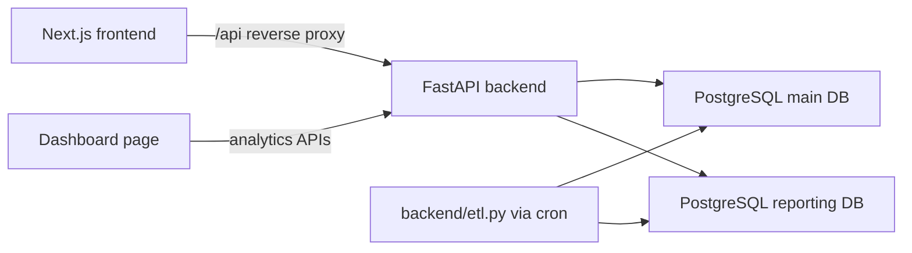

# Archive Thrift - Cloud Computing Final Project

Archive Thrift is a demo-ready full-stack thrift-store e-commerce system with a premium storefront, FastAPI API, PostgreSQL transactional database, separate PostgreSQL reporting database, cron-runnable ETL, and an analytics dashboard.

## Tech Stack

| Layer | Technology |
| --- | --- |
| Frontend | Next.js App Router, React, TypeScript, Tailwind CSS, lucide-react |
| Backend | FastAPI, SQLAlchemy, Uvicorn/Gunicorn |
| Main DB | PostgreSQL transactional database |
| Reporting DB | Separate PostgreSQL analytics database |
| ETL | Python script runnable manually or by Linux cron |
| VPS Runtime | Ubuntu, Nginx, systemd, PM2, PostgreSQL |

Local development can use SQLite fallback files, but VPS deployment should use PostgreSQL URLs for both databases.

## Features

- Premium responsive thrift-store UI.
- Landing page with hero, featured products, and category sections.
- Product listing with search and filters for Clothing, Bags, and Accessories.
- Product detail page with images, price, category, description, stock, and add-to-cart.
- Register/login with password hashing and JWT authentication.
- Quantity-aware frontend cart with localStorage persistence.
- Protected checkout that creates real backend orders and order items.
- Stock reduction and sold-out status updates after checkout.
- Reporting dashboard for total revenue, total orders, customers, daily sales, top products, and customer growth.
- ETL from transactional DB to reporting DB.
- Hostinger VPS deployment guide in [docs/HOSTINGER_VPS_DEPLOYMENT.md](docs/HOSTINGER_VPS_DEPLOYMENT.md).

## Architecture



## Database Schema

Transactional database:

- `users`: `id`, `name`, `email`, `hashed_password`, `created_at`
- `products`: `id`, `name`, `description`, `price`, `category`, `image_url`, `stock_quantity`, `status`, `created_at`
- `orders`: `id`, `user_id`, `total_amount`, `status`, customer/shipping/payment fields, `created_at`
- `order_items`: `id`, `order_id`, `product_id`, `quantity`, `unit_price`, `subtotal`

Reporting database:

- `dim_products`
- `dim_customers`
- `fact_orders`
- `fact_order_items`
- `daily_sales_summary`

## API Endpoints

| Method | Endpoint | Purpose |
| --- | --- | --- |
| `POST` | `/auth/register` | Create user and return JWT |
| `POST` | `/auth/login` | Login and return JWT |
| `GET` | `/auth/me` | Validate JWT and return current user |
| `GET` | `/products` | List products, supports `category` and `search` |
| `GET` | `/products/{id}` | Product details |
| `POST` | `/orders` | Protected checkout, creates order and order items |
| `GET` | `/orders/me` | Current user's orders |
| `GET` | `/analytics/summary` | Revenue, orders, customers |
| `GET` | `/analytics/sales` | Daily sales summary |
| `GET` | `/analytics/top-products` | Top products by units sold |
| `GET` | `/analytics/customers` | Customer growth |

## Local Setup

### Backend

```bash
cd backend
python -m venv venv
source venv/bin/activate
pip install -r requirements.txt
cp .env.example .env
python seed.py
python etl.py
uvicorn main:app --reload
```

Windows PowerShell:

```powershell
cd backend
python -m venv venv
venv\Scripts\activate
pip install -r requirements.txt
Copy-Item .env.example .env
python seed.py
python etl.py
uvicorn main:app --reload
```

### Frontend

```bash
cd frontend
npm install
cp .env.example .env.local
npm run dev
```

Open `http://localhost:3000`. The frontend proxies `/api/*` to `BACKEND_URL` from `frontend/.env.local`.

## Environment Variables

Backend `backend/.env`:

```env
DATABASE_URL=sqlite:///./thrift_main.sqlite
REPORTING_DATABASE_URL=sqlite:///./thrift_reporting.sqlite
JWT_SECRET_KEY=replace_with_a_long_random_secret
JWT_EXPIRES_SECONDS=86400
FRONTEND_URL=http://localhost:3000
REDIS_URL=
```

For Hostinger VPS, replace the SQLite URLs with PostgreSQL URLs as shown in the deployment guide.

Frontend `frontend/.env.local`:

```env
NEXT_PUBLIC_API_URL=/api
BACKEND_URL=http://127.0.0.1:8000
```

## ETL Process

Run manually:

```bash
cd backend
python etl.py
```

Cron script:

```bash
cd backend
chmod +x run_etl.sh
./run_etl.sh
```

The ETL extracts users, products, orders, and order items from the transactional database, loads reporting dimensions/facts, and rebuilds `daily_sales_summary`.

## Demo Flow

1. Start PostgreSQL or use local SQLite fallback.
2. Start backend with `uvicorn main:app --reload`.
3. Run `python seed.py` to create sample thrift products and demo orders.
4. Run `python etl.py` to populate the reporting database.
5. Start frontend with `npm run dev`.
6. Visit the home page, browse products, filter by category, and open a product detail page.
7. Login with `demo@example.com` / `DemoPass123` or register a new account.
8. Add products to cart and checkout.
9. Run `python etl.py` again.
10. Refresh `/dashboard` to show updated sales, revenue, top products, and customers.

## Verification Commands

Backend:

```bash
cd backend
python -m unittest discover -s tests
python -m compileall .
python seed.py
python etl.py
```

Frontend:

```bash
cd frontend
npm install
npm run lint
npm run build
```

## VPS Deployment

Use the complete Hostinger Ubuntu VPS guide:

[docs/HOSTINGER_VPS_DEPLOYMENT.md](docs/HOSTINGER_VPS_DEPLOYMENT.md)

It includes SSH, package installation, PostgreSQL users/databases, environment files, backend systemd, frontend PM2, Nginx reverse proxy, cron ETL, testing, and troubleshooting.
